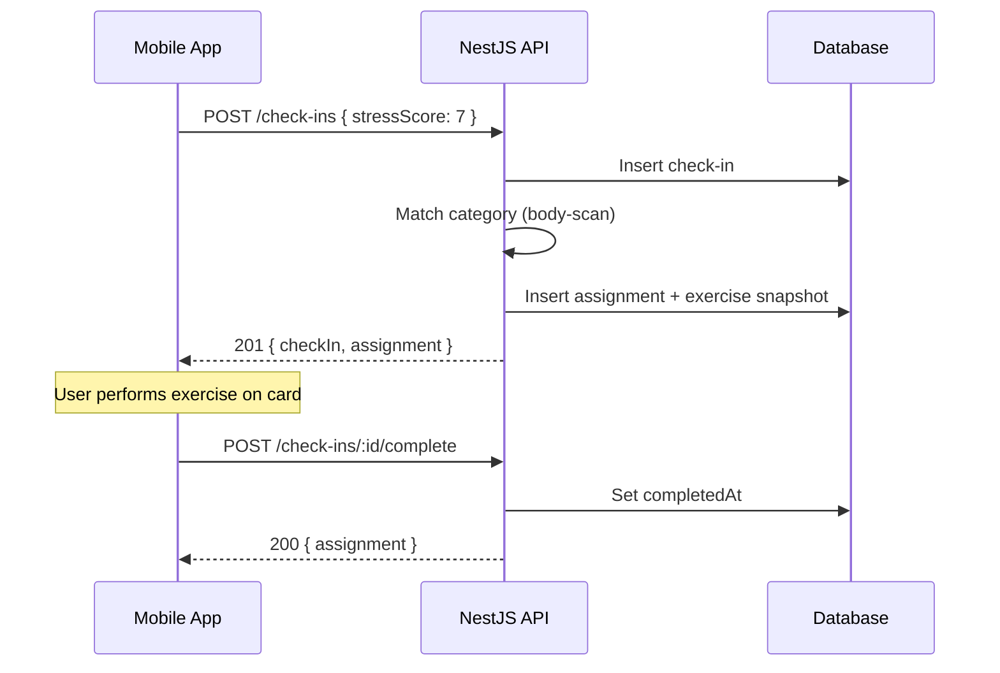
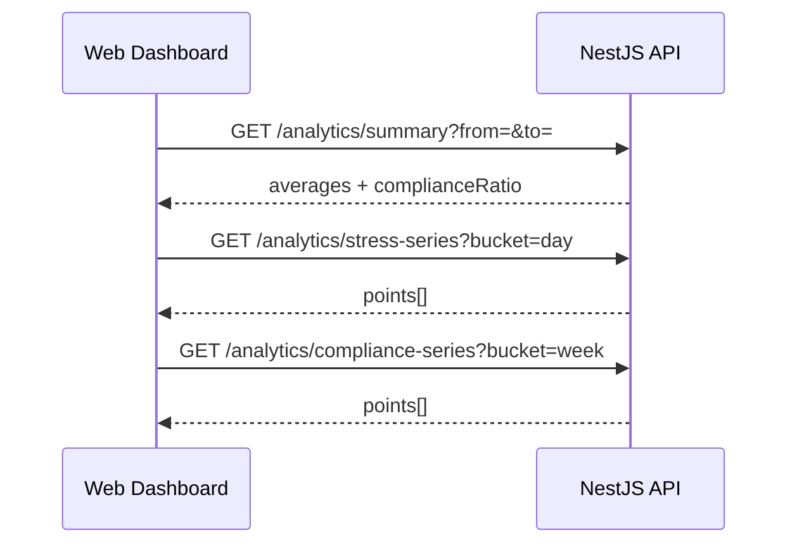

# Aura API — Endpoint Skeleton (MVP v1.0)

Design reference for the NestJS backend. Scope is derived from [docs/PRD.md](../../../docs/PRD.md): mobile check-in → exercise dispatch → completion logging, plus web analytics aggregation.

**Conventions**

| Item | Choice |
|------|--------|
| Base URL | `/api/v1` |
| Format | JSON (`Content-Type: application/json`) |
| Auth | `Authorization: Bearer <access_token>` on protected routes |
| IDs | UUID v4 strings |
| Timestamps | ISO 8601 UTC (`2026-06-02T14:30:00.000Z`) |
| Errors | `{ "statusCode": number, "message": string \| string[], "error"?: string }` |

Shared request/response types should live in `packages/types` and be imported by mobile, web, and API.

---

## Domain model (logical)

```
User
  └── CheckIn (stressScore 1–10, createdAt)
        └── ExerciseAssignment (exercise snapshot + category)
              └── Completion (completedAt | null)
```

- A **check-in** is created when the user submits a stress score.
- The API **assigns** one exercise immediately (deterministic rule matrix).
- **Completion** is a separate write when the user taps “Done” on the exercise card.

---

## Deterministic exercise matching (MVP)

Static rule matrix: map `stressScore` → `ExerciseCategory`. The mobile client does not choose the exercise; it only receives the assignment.

| Stress score | Category | Rationale (product) |
|--------------|----------|---------------------|
| 1–3 | `grounding` | Low arousal — light centering |
| 4–6 | `breathing` | Moderate — regulation |
| 7–8 | `body-scan` | Elevated — somatic release |
| 9–10 | `urgent-calm` | High — short, directive relief |

Implementation note: `Exercise` records are seeded in the database per category; assignment picks the default (or only) exercise for that category at check-in time.

---

## Authentication (web + mobile)

MVP needs a user boundary for “strict isolation” of logs. Mobile may use the same token flow as web or a device-linked session—both resolve to `userId`.

| Method | Path | Auth | Description |
|--------|------|------|-------------|
| `POST` | `/auth/register` | No | Create account (email + password) |
| `POST` | `/auth/login` | No | Returns `accessToken`, `refreshToken`, `user` |
| `POST` | `/auth/refresh` | No | Body: `{ "refreshToken" }` → new access token |
| `GET` | `/auth/me` | Yes | Current user profile |

**`POST /auth/login` — response (example)**

```json
{
  "accessToken": "eyJ...",
  "refreshToken": "eyJ...",
  "expiresIn": 3600,
  "user": {
    "id": "550e8400-e29b-41d4-a716-446655440000",
    "email": "user@example.com"
  }
}
```

---

## Mobile — check-in flow

Primary user journey: score → exercise card → complete.

### 1. Submit stress check-in (creates log + assignment)

| Method | Path | Auth |
|--------|------|------|
| `POST` | `/check-ins` | Yes |

**Request**

```json
{
  "stressScore": 7
}
```

| Field | Type | Rules |
|-------|------|-------|
| `stressScore` | `integer` | Required, 1–10 inclusive |

**Response `201 Created`**

```json
{
  "checkIn": {
    "id": "a1b2c3d4-...",
    "stressScore": 7,
    "createdAt": "2026-06-02T14:30:00.000Z"
  },
  "assignment": {
    "id": "e5f6g7h8-...",
    "category": "body-scan",
    "exercise": {
      "id": "ex-001",
      "title": "5-Minute Body Scan",
      "description": "Progressively release tension from head to toe.",
      "durationMinutes": 5
    },
    "completedAt": null
  }
}
```

**Errors**

| Status | When |
|--------|------|
| `400` | Invalid `stressScore` |
| `401` | Missing or invalid token |

**NestJS sketch**

- `CheckInsModule` → `CheckInsController.create()`
- `CheckInsService.create()` → persist check-in, call `ExerciseMatchingService.resolve(stressScore)`, create assignment, return DTO

---

### 2. Get exercise for an existing check-in (optional)

Use when the app reopens mid-flow or needs to refresh the card without re-submitting a score.

| Method | Path | Auth |
|--------|------|------|
| `GET` | `/check-ins/:checkInId/assignment` | Yes |

**Response `200 OK`** — same `assignment` object shape as above.

**Errors**

| Status | When |
|--------|------|
| `404` | Check-in not found or not owned by user |

---

### 3. Mark exercise completed

| Method | Path | Auth |
|--------|------|------|
| `POST` | `/check-ins/:checkInId/complete` | Yes |

**Request** — empty body or optional metadata for future analytics:

```json
{}
```

**Response `200 OK`**

```json
{
  "assignment": {
    "id": "e5f6g7h8-...",
    "checkInId": "a1b2c3d4-...",
    "completedAt": "2026-06-02T14:38:00.000Z"
  }
}
```

**Errors**

| Status | When |
|--------|------|
| `404` | Check-in / assignment not found |
| `409` | Already completed |

**NestJS sketch**

- `CheckInsController.complete(checkInId)`
- Idempotent option (v1.1): return `200` with existing `completedAt` if already done

---

### 4. Recent history (mobile list / lock-in confirmation)

Lightweight list for “locked into history” UX; not full analytics.

| Method | Path | Auth |
|--------|------|------|
| `GET` | `/check-ins` | Yes |

**Query**

| Param | Type | Default | Description |
|-------|------|---------|-------------|
| `limit` | `integer` | `20` | Max items (cap e.g. 50) |
| `cursor` | `string` | — | Opaque pagination cursor |

**Response `200 OK`**

```json
{
  "items": [
    {
      "id": "a1b2c3d4-...",
      "stressScore": 7,
      "createdAt": "2026-06-02T14:30:00.000Z",
      "assignment": {
        "exerciseTitle": "5-Minute Body Scan",
        "completedAt": "2026-06-02T14:38:00.000Z"
      }
    }
  ],
  "nextCursor": null
}
```

---

## Catalog — exercises (read-only, MVP)

Exercises are mostly static; mobile typically gets them embedded in the assignment response. Expose catalog for admin/debug and future web use.

| Method | Path | Auth |
|--------|------|------|
| `GET` | `/exercises` | Yes |
| `GET` | `/exercises/:exerciseId` | Yes |

**`GET /exercises` — response**

```json
{
  "items": [
    {
      "id": "ex-001",
      "category": "body-scan",
      "title": "5-Minute Body Scan",
      "description": "...",
      "durationMinutes": 5
    }
  ]
}
```

---

## Web dashboard — analytics aggregation

Partitioned telemetry for trend widgets and charts. All routes scoped to the authenticated user.

### Summary metrics

| Method | Path | Auth |
|--------|------|------|
| `GET` | `/analytics/summary` | Yes |

**Query**

| Param | Type | Default | Description |
|-------|------|---------|-------------|
| `from` | ISO date | 30 days ago | Range start (inclusive) |
| `to` | ISO date | now | Range end (inclusive) |

**Response `200 OK`**

```json
{
  "period": { "from": "2026-05-03", "to": "2026-06-02" },
  "averageStressScore": 5.4,
  "checkInCount": 42,
  "completionCount": 35,
  "complianceRatio": 0.83
}
```

`complianceRatio` = completed assignments / check-ins with an assignment in range.

---

### Stress over time (line chart)

| Method | Path | Auth |
|--------|------|------|
| `GET` | `/analytics/stress-series` | Yes |

**Query**

| Param | Type | Default | Description |
|-------|------|---------|-------------|
| `from` | ISO date | required | |
| `to` | ISO date | required | |
| `bucket` | `day` \| `week` \| `month` | `day` | Aggregation chunk |

**Response `200 OK`**

```json
{
  "bucket": "day",
  "points": [
    { "date": "2026-06-01", "averageStress": 6.2, "count": 3 },
    { "date": "2026-06-02", "averageStress": 5.0, "count": 2 }
  ]
}
```

---

### Compliance over time

| Method | Path | Auth |
|--------|------|------|
| `GET` | `/analytics/compliance-series` | Yes |

Same query params as `stress-series`.

**Response `200 OK`**

```json
{
  "bucket": "week",
  "points": [
    { "periodStart": "2026-05-26", "complianceRatio": 0.75, "completed": 6, "assigned": 8 }
  ]
}
```

---

### Raw check-ins export (optional table view)

| Method | Path | Auth |
|--------|------|------|
| `GET` | `/analytics/check-ins` | Yes |

Paginated, same shape as mobile history with optional `from` / `to` filters. Prefer cursor pagination for large histories.

---

## Health & meta

| Method | Path | Auth | Description |
|--------|------|------|-------------|
| `GET` | `/health` | No | Liveness (`{ "status": "ok" }`) |
| `GET` | `/` | No | Optional API info / version |

---

## NestJS module map (implementation skeleton)

```
src/
├── main.ts                    # global prefix: api/v1
├── app.module.ts
├── auth/
│   ├── auth.module.ts
│   ├── auth.controller.ts     # /auth/*
│   ├── auth.service.ts
│   └── guards/                # JwtAuthGuard
├── users/
│   └── users.module.ts
├── check-ins/
│   ├── check-ins.module.ts
│   ├── check-ins.controller.ts # /check-ins/*
│   ├── check-ins.service.ts
│   └── dto/
│       ├── create-check-in.dto.ts
│       └── check-in-response.dto.ts
├── exercises/
│   ├── exercises.module.ts
│   ├── exercises.controller.ts # /exercises/*
│   ├── exercises.service.ts
│   └── exercise-matching.service.ts  # deterministic matrix
├── analytics/
│   ├── analytics.module.ts
│   ├── analytics.controller.ts # /analytics/*
│   └── analytics.service.ts    # bucketed SQL / Prisma aggregates
└── prisma/                    # or database module
    └── prisma.service.ts
```

**Suggested controller routes (decorators)**

```typescript
@Controller('check-ins')
@UseGuards(JwtAuthGuard)
export class CheckInsController {
  @Post()
  create(@Body() dto: CreateCheckInDto, @CurrentUser() user: User) {}

  @Get()
  findAll(@Query() query: ListCheckInsQueryDto, @CurrentUser() user: User) {}

  @Get(':checkInId/assignment')
  getAssignment(@Param('checkInId') id: string, @CurrentUser() user: User) {}

  @Post(':checkInId/complete')
  complete(@Param('checkInId') id: string, @CurrentUser() user: User) {}
}
```

---

## Shared types (`packages/types` — draft)

```typescript
export type ExerciseCategory =
  | 'grounding'
  | 'breathing'
  | 'body-scan'
  | 'urgent-calm';

export interface ExerciseDto {
  id: string;
  category: ExerciseCategory;
  title: string;
  description: string;
  durationMinutes: number;
}

export interface CheckInDto {
  id: string;
  stressScore: number;
  createdAt: string;
}

export interface AssignmentDto {
  id: string;
  category: ExerciseCategory;
  exercise: ExerciseDto;
  completedAt: string | null;
}

export interface CreateCheckInRequest {
  stressScore: number;
}

export interface CreateCheckInResponse {
  checkIn: CheckInDto;
  assignment: AssignmentDto;
}
```

---

## Mobile sequence (end-to-end)



---

## Web sequence (dashboard load)



---

## Out of scope (v2.0+ per PRD)

Documented for boundary clarity; **do not** implement in MVP skeleton:

| Feature | Future endpoint idea |
|---------|-------------------|
| Mood Cloud tags | `POST /check-ins` extended with `moodTags: string[]` |
| AI-generated exercises | `POST /exercises/generate` (agent) |
| Push reminders | `POST /devices/register`, scheduling service |
| Qualitative analytics | `GET /analytics/mood-correlations` |

---

## Open decisions (track before implementation)

1. **Guest / anonymous mobile** — MVP assumes authenticated user; confirm if check-in requires login on first launch.
2. **Exercise snapshot** — store full `title`/`description` on assignment at check-in time so catalog edits do not rewrite history.
3. **Pagination** — cursor vs offset; recommend cursor for `/check-ins` lists.
4. **Rate limiting** — light limit on `POST /check-ins` to prevent accidental spam (e.g. 60/hour/user).

---

## Related docs

- Product scope: [docs/PRD.md](../../../docs/PRD.md)
- UI tokens (clients): [docs/DESIGN.md](../../../docs/DESIGN.md)
