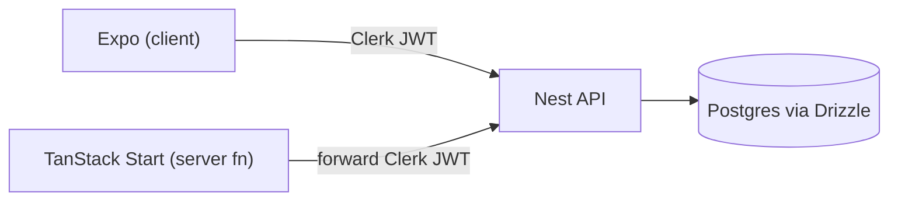
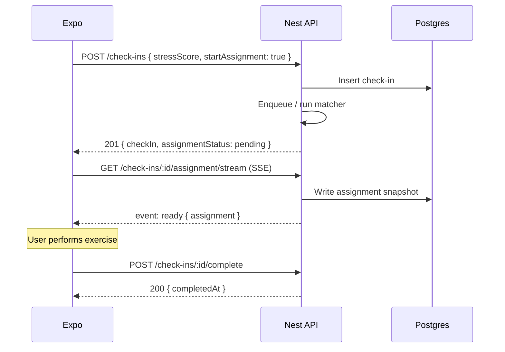
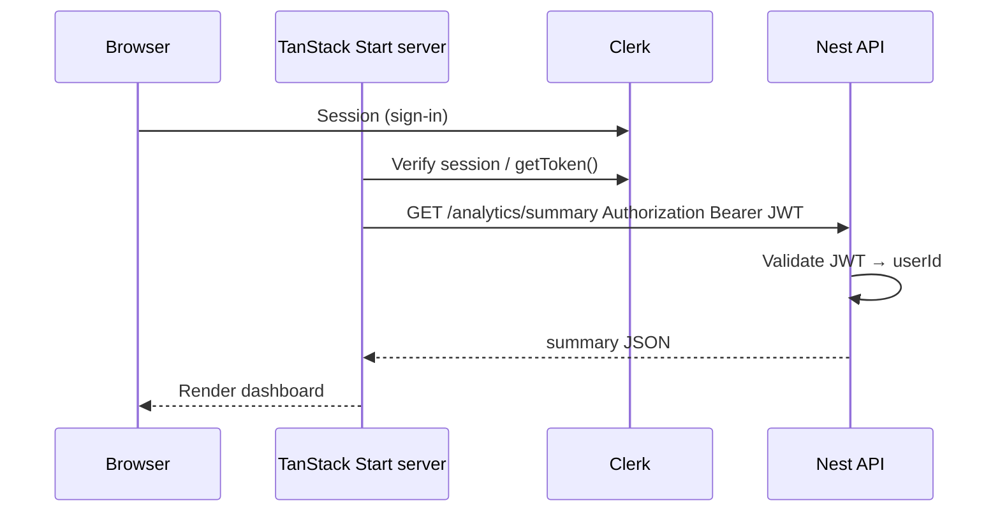

# Aura API — Endpoint Skeleton (MVP v1.0)

Design reference for the NestJS backend. Scope is derived from [docs/PRD.md](../../../docs/PRD.md): mobile check-in → async exercise assignment → completion logging, plus web analytics aggregation.

---

## Stack & monorepo boundaries

| Layer | Choice | Notes |
|-------|--------|-------|
| Transport | **REST + JSON** | Internal API for Expo (client) and TanStack Start (server). Not gRPC for MVP. |
| Contracts | **Zod** in `packages/validators` | Parse on API; reuse on mobile/web for forms. Types via `z.infer<>` (optionally re-exported from `packages/types`). |
| Database | **Drizzle** in `packages/db` | Schema, migrations (`drizzle-kit`), client — consumed **only** by `apps/api` (and scripts). Web/mobile do not import DB. |
| Auth | **Clerk** (SDK on clients) + **JWT validation on API** | Nest verifies Clerk-issued session JWTs (JWKS). No custom login/register on this API. |



---

## Conventions

| Item | Choice |
|------|--------|
| Base URL | `/api/v1` |
| Format | JSON (`Content-Type: application/json`) |
| Auth | `Authorization: Bearer <clerk_session_jwt>` on protected routes |
| IDs | **UUID v7** for time-ordered domain rows (see [Identifiers](#identifiers)) |
| Timestamps | ISO 8601 UTC (`2026-06-02T14:30:00.000Z`) |
| Errors | `{ "statusCode": number, "message": string \| string[], "error"?: string }` |
| SSE | `Content-Type: text/event-stream` (see [Assignment SSE](#assignment-sse)) |

---

## Identifiers

Time-ordered resources use **UUID version 7** (RFC 9562): millisecond timestamp in the high bits, so IDs are roughly sortable by creation time without exposing a separate sequence.

| Table / resource | ID type | Generated by |
|------------------|---------|--------------|
| `check_ins` | UUID v7 | API on `POST /check-ins` |
| `exercise_assignments` | UUID v7 | API when assignment starts |
| `exercises` (catalog) | UUID v7 | Seeds / admin create |
| `users` (internal row) | UUID v7 or v4 | API on first Clerk sync (either is fine; not exposed as a “timeline” key) |

**Why v7 here**

- Aligns with keyset pagination on `(created_at, id)` — `id` reinforces time order if clocks match.
- Stable, opaque, URL-safe (same string format as v4 in JSON APIs).

**Implementation**

- Generate in the API layer (e.g. `uuidv7` npm package) before insert; Postgres column type `uuid`.
- Do not accept client-supplied IDs for these resources on create.
- Path params and Zod: validate as UUID string (v7 is still a standard UUID canonical form).

**Not v7**

- Clerk `sub` / `user_…` — external identifier, stored as `clerk_user_id` on `users`.

---

## Authentication

Identity is owned by **Clerk** on each frontend. The API only answers: *is this JWT valid, and who is the user?*

### Callers

| Caller | How it reaches the API | Token |
|--------|------------------------|-------|
| **Expo (mobile)** | Device → API directly | `Authorization: Bearer <token>` from Clerk Expo SDK (`getToken()`) |
| **TanStack Start (web)** | Browser → Clerk session; **server function** → API | Same: forward the user’s Clerk session JWT from the server (after session is verified on Start). |

The API does **not** distinguish mobile vs web if the Clerk JWT is valid. Origin does not matter once the user is authenticated.

### Nest implementation

- `ClerkJwtGuard` (or generic JWT guard): validate signature via Clerk **JWKS**, check `iss` / `aud` / expiry.
- `req.user.id` = Clerk `sub` (optionally mapped to an internal `users.id` row on first request).
- No `user_id` in request body for authorization.
- Marketing **hero / anonymous** UX is frontend-only; all API routes that touch user data require a JWT.

### User profile

| Method | Path | Auth | Description |
|--------|------|------|-------------|
| `GET` | `/users/me` | Yes | Profile + settings (e.g. exercise recommendations toggle) |

**`GET /users/me` — response (example)**

```json
{
  "id": "550e8400-e29b-41d4-a716-446655440000",
  "clerkUserId": "user_2abc...",
  "email": "user@example.com",
  "settings": {
    "exerciseRecommendationsEnabled": true
  }
}
```

| Method | Path | Auth | Description |
|--------|------|------|-------------|
| `PATCH` | `/users/me/settings` | Yes | Update `exerciseRecommendationsEnabled` |

### Local development

- Use Clerk dev instances and normal short-lived session tokens in integration tests.
- Optional: longer JWT/session tolerance via Clerk dev settings, or document a dev-only bypass — **never** in production.

---

## Domain model (logical)

```
User (synced from Clerk sub)
  └── CheckIn (stressScore 1–10, createdAt)
        └── ExerciseAssignment (status, category, exercise snapshot)
              └── completedAt (set via complete endpoint)
```

- **Check-in** — created when the user submits a stress score (fast ack).
- **Assignment** — separate step; may be `pending` → `ready` (async). MVP matching can finish in-process but the contract stays async-friendly for future AI.
- **Snapshot** — assignment stores copied `title`, `description`, `durationMinutes`, `category` (and optional `exerciseId`) so catalog edits do not rewrite history. Future dynamic exercises = new `exercises` rows, not mutating past assignments.

### Assignment status

| Status | Meaning |
|--------|---------|
| `skipped` | User/settings disabled recommendations; no assignment row |
| `pending` | Matching/generation in progress |
| `ready` | Snapshot populated; client can show card |
| `failed` | Matching failed; client shows error + retry |

---

## User settings — exercise recommendations

When `exerciseRecommendationsEnabled` is `false`:

- `POST /check-ins` returns `assignmentStatus: "skipped"`.
- Do not open assignment SSE.
- Check-in and analytics still work.

When `true` (default):

- After check-in, client starts assignment (explicit `POST` or server auto-starts — see below) and subscribes to SSE if `pending`.

---

## Deterministic exercise matching (MVP)

Static rule matrix: `stressScore` → `ExerciseCategory`. Client does not pick the exercise.

| Stress score | Category | Rationale (product) |
|--------------|----------|---------------------|
| 1–3 | `grounding` | Low arousal — light centering |
| 4–6 | `breathing` | Moderate — regulation |
| 7–8 | `body-scan` | Elevated — somatic release |
| 9–10 | `urgent-calm` | High — short, directive relief |

Seeded `exercises` per category; matcher picks the default exercise and copies fields into the assignment snapshot.

---

## Mobile — check-in flow

Primary journey: score → (optional) “Preparing your exercise…” → card → complete.

### 1. Submit stress check-in (fast ack only)

| Method | Path | Auth |
|--------|------|------|------|
| `POST` | `/check-ins` | Yes |

**Request**

```json
{
  "stressScore": 7,
  "startAssignment": true
}
```

| Field | Type | Rules |
|-------|------|-------|
| `stressScore` | `integer` | Required, 1–10 inclusive |
| `startAssignment` | `boolean` | Optional, default `true` when recommendations enabled; `false` logs only |

**Response `201 Created`**

```json
{
  "checkIn": {
    "id": "a1b2c3d4-...",
    "stressScore": 7,
    "createdAt": "2026-06-02T14:30:00.000Z"
  },
  "assignmentStatus": "pending"
}
```

`assignmentStatus` values: `pending` | `skipped` | `ready` (if matcher finishes synchronously in MVP).

If `startAssignment` is true and status is `pending`, client opens [SSE](#assignment-sse) for this `checkInId`. If `ready`, client may skip SSE and `GET` the assignment once.

**Rate limit:** `@nestjs/throttler` on this route (e.g. 30 requests / 60s per `userId`). In-memory store for MVP; Redis storage when running multiple replicas.

**Errors**

| Status | When |
|--------|------|
| `400` | Invalid body (Zod) |
| `401` | Missing or invalid Clerk JWT |
| `429` | Throttled |

---

### 2. Start assignment (optional explicit step)

Use when `POST /check-ins` was created with `startAssignment: false`, or to retry after `failed`.

| Method | Path | Auth |
|--------|------|------|
| `POST` | `/check-ins/:checkInId/assignment` | Yes |

**Response**

| Code | Body |
|------|------|
| `201` / `200` | `{ "assignmentStatus": "pending" }` or `"ready"` + assignment if sync |
| `409` | Assignment already `ready` |
| `404` | Check-in not found / not owned |

Idempotent: calling again while `pending` returns `200` + `pending`.

---

### 3. Get assignment (poll fallback)

| Method | Path | Auth |
|--------|------|------|
| `GET` | `/check-ins/:checkInId/assignment` | Yes |

**Response `200 OK`**

```json
{
  "status": "ready",
  "assignment": {
    "id": "e5f6g7h8-...",
    "category": "body-scan",
    "exercise": {
      "id": "ex-001",
      "title": "5-Minute Body Scan",
      "description": "Progressively release tension from head to toe.",
      "durationMinutes": 5
    },
    "completedAt": null
  }
}
```

While `pending`: `{ "status": "pending" }` (no `assignment` body).

**Errors:** `404` if check-in not found or not owned.

---

### Assignment SSE

Open **one SSE connection per check-in** after receiving `assignmentStatus: "pending"`. Close the stream when the server emits `ready` or `failed`, or on client timeout.

| Method | Path | Auth |
|--------|------|------|
| `GET` | `/check-ins/:checkInId/assignment/stream` | Yes (same Clerk JWT; some clients send token as query param only if required by SSE library — prefer header) |

**Event types**

```
event: status
data: {"status":"pending"}

event: ready
data: {"status":"ready","assignment":{ ... same shape as GET ... }}

event: failed
data: {"status":"failed","message":"..."}
```

Server closes connection after `ready` or `failed`. Client should fall back to `GET .../assignment` polling if the stream drops.

**Nest sketch:** `@Sse()` controller or manual `text/event-stream`; assignment worker emits on completion (in-process for MVP; queue later for AI).

---

### 4. Mark exercise completed

| Method | Path | Auth |
|--------|------|------|
| `POST` | `/check-ins/:checkInId/complete` | Yes |

**Request:** `{}` (optional metadata later)

**Response `200 OK`**

```json
{
  "assignment": {
    "id": "e5f6g7h8-...",
    "checkInId": "a1b2c3d4-...",
    "completedAt": "2026-06-02T14:38:00.000Z"
  }
}
```

**Errors:** `404` not found; `409` already completed (optional idempotent `200` with existing `completedAt`).

---

### 5. Recent history (mobile)

| Method | Path | Auth |
|--------|------|------|
| `GET` | `/check-ins` | Yes |

**Query**

| Param | Type | Default | Description |
|-------|------|---------|-------------|
| `limit` | `integer` | `20` | Max items (cap 50) |
| `cursor` | `string` | — | Optional keyset cursor (see [Pagination](#pagination)) |

**MVP:** omit `cursor`; `ORDER BY created_at DESC LIMIT 20` is sufficient.

**Response `200 OK`**

```json
{
  "items": [
    {
      "id": "a1b2c3d4-...",
      "stressScore": 7,
      "createdAt": "2026-06-02T14:30:00.000Z",
      "assignment": {
        "status": "ready",
        "exerciseTitle": "5-Minute Body Scan",
        "completedAt": "2026-06-02T14:38:00.000Z"
      }
    }
  ],
  "nextCursor": null
}
```

---

## Catalog — exercises (read-only)

| Method | Path | Auth |
|--------|------|------|
| `GET` | `/exercises` | Yes |
| `GET` | `/exercises/:exerciseId` | Yes |

Assignments still use **snapshots**; catalog is for admin/debug and future tooling.

---

## Web dashboard — analytics

Called from **TanStack Start server functions** with the **same forwarded Clerk JWT**. Nest scopes all aggregates to `req.user.id`.

| Method | Path | Auth |
|--------|------|------|
| `GET` | `/analytics/summary` | Yes |
| `GET` | `/analytics/stress-series` | Yes |
| `GET` | `/analytics/compliance-series` | Yes |
| `GET` | `/analytics/check-ins` | Yes |

### Summary

**Query:** `from`, `to` (ISO dates; default last 30 days)

```json
{
  "period": { "from": "2026-05-03", "to": "2026-06-02" },
  "averageStressScore": 5.4,
  "checkInCount": 42,
  "completionCount": 35,
  "complianceRatio": 0.83
}
```

`complianceRatio` = completed assignments / check-ins with an assignment in range.

### Stress series

**Query:** `from`, `to` (required), `bucket` = `day` | `week` | `month` (default `day`)

```json
{
  "bucket": "day",
  "points": [
    { "date": "2026-06-01", "averageStress": 6.2, "count": 3 }
  ]
}
```

### Compliance series

Same query params as stress series.

```json
{
  "bucket": "week",
  "points": [
    { "periodStart": "2026-05-26", "complianceRatio": 0.75, "completed": 6, "assigned": 8 }
  ]
}
```

### Check-ins table (export)

**Query:** `from`, `to`, `limit`, `cursor` — **use keyset cursor here** when lists grow (see [Pagination](#pagination)).

---

## Pagination

### Recent mobile history (`GET /check-ins`)

- **MVP:** fixed `limit` (default 20), no cursor.
- **Later:** optional `cursor` using keyset on `(created_at DESC, id DESC)` (v7 `id` is time-ordered; keep `created_at` in the key for clarity and same-timestamp ties).

### Analytics export (`GET /analytics/check-ins`)

- Prefer cursor from first version that needs paging.

**Keyset algorithm**

1. `ORDER BY created_at DESC, id DESC LIMIT :limit + 1`.
2. If `cursor` present, decode base64url JSON `{ "createdAt": "...", "id": "..." }` and add  
   `WHERE (created_at, id) < (:createdAt, :id)` (Postgres row comparison).
3. Return `limit` items; if a `(limit + 1)`th row exists, set `nextCursor` from the last returned row.

**Note:** Because check-in IDs are UUID v7, a cursor of `{ "id": "..." }` alone can work for user-scoped lists when `created_at` is redundant; the API still uses both fields so ordering is explicit and robust across concurrent inserts in the same millisecond.

---

## Rate limiting

- Package: `@nestjs/throttler`.
- Apply to `POST /check-ins` (and optionally `POST .../assignment`).
- Tracker: `req.user.id` from JWT (not IP).
- MVP: in-memory store (single instance).
- Scale-out: Redis-backed throttler storage.

---

## Health & meta

| Method | Path | Auth | Description |
|--------|------|------|-------------|
| `GET` | `/health` | No | `{ "status": "ok" }` |
| `GET` | `/` | No | API name / version |

---

## NestJS module map

```
src/
├── main.ts                         # global prefix api/v1
├── app.module.ts
├── auth/
│   ├── clerk-jwt.guard.ts
│   └── current-user.decorator.ts
├── users/
│   ├── users.module.ts
│   └── users.controller.ts         # GET/PATCH /users/me
├── check-ins/
│   ├── check-ins.module.ts
│   ├── check-ins.controller.ts
│   ├── check-ins.service.ts
│   ├── assignment-sse.controller.ts
│   └── assignment.processor.ts     # MVP: inline; later: queue
├── exercises/
│   ├── exercises.module.ts
│   ├── exercises.controller.ts
│   └── exercise-matching.service.ts
├── analytics/
│   ├── analytics.module.ts
│   └── analytics.controller.ts
└── database/
    └── database.module.ts          # imports @aura/db

packages/
├── db/                             # Drizzle schema + client + migrations
└── validators/                     # Zod schemas (shared)
```

**Controller sketch**

```typescript
@Controller('check-ins')
@UseGuards(ClerkJwtGuard)
export class CheckInsController {
  @Post()
  @Throttle({ default: { limit: 30, ttl: 60_000 } })
  create(@Body() dto: CreateCheckInDto, @CurrentUser() user: User) {}

  @Post(':checkInId/assignment')
  startAssignment(@Param('checkInId') id: string, @CurrentUser() user: User) {}

  @Get(':checkInId/assignment')
  getAssignment(@Param('checkInId') id: string, @CurrentUser() user: User) {}

  @Sse(':checkInId/assignment/stream')
  assignmentStream(@Param('checkInId') id: string, @CurrentUser() user: User) {}

  @Post(':checkInId/complete')
  complete(@Param('checkInId') id: string, @CurrentUser() user: User) {}

  @Get()
  findAll(@Query() query: ListCheckInsQueryDto, @CurrentUser() user: User) {}
}
```

---

## Shared validators (`packages/validators` — draft)

```typescript
import { z } from 'zod';

/** Standard UUID string (v7 in DB; Zod does not distinguish version). */
export const UuidSchema = z.string().uuid();

export const StressScoreSchema = z.number().int().min(1).max(10);

export const CreateCheckInSchema = z.object({
  stressScore: StressScoreSchema,
  startAssignment: z.boolean().optional(),
});

export const ExerciseCategorySchema = z.enum([
  'grounding',
  'breathing',
  'body-scan',
  'urgent-calm',
]);

export const AssignmentStatusSchema = z.enum([
  'skipped',
  'pending',
  'ready',
  'failed',
]);

export type CreateCheckInRequest = z.infer<typeof CreateCheckInSchema>;
export type AssignmentStatus = z.infer<typeof AssignmentStatusSchema>;
```

---

## Sequences

### Mobile (check-in + SSE)



### Web (analytics via Start server)



---

## Database notes (Drizzle)

Primary keys for `check_ins`, `exercise_assignments`, and `exercises` are **`uuid` with v7 values** generated in application code (not `gen_random_uuid()` v4 defaults).

**`check_ins`** (illustrative)

| Column | Notes |
|--------|--------|
| `id` | UUID v7 PK |
| `user_id` | FK → `users` |
| `stress_score` | 1–10 |
| `created_at` | timestamptz (should match v7 timestamp component at insert) |

**`exercise_assignments`** (illustrative)

| Column | Notes |
|--------|--------|
| `id` | UUID v7 PK |
| `check_in_id` | FK |
| `status` | `pending` \| `ready` \| `failed` |
| `category` | Snapshot |
| `exercise_id` | Nullable FK to catalog |
| `title`, `description`, `duration_minutes` | Snapshot copies |
| `completed_at` | Set on complete |

Do not rely on live joins to `exercises` for historical display.

---

## Out of scope (v2.0+ per PRD)

| Feature | Future idea |
|---------|-------------|
| Mood Cloud tags | Extend `POST /check-ins` with `moodTags` |
| AI-generated exercises | Async assignment processor + longer SSE |
| Push reminders | `POST /devices/register` + scheduler |
| Qualitative analytics | `GET /analytics/mood-correlations` |
| gRPC / tRPC | Revisit if clients and API want tighter coupling |

---

## Resolved decisions

| Topic | Decision |
|-------|----------|
| Check-in vs assignment | Separate resources; fast check-in ack; assignment async with `pending` / SSE |
| Transport | REST + JSON |
| Contracts | Shared Zod in `packages/validators` |
| ORM | Drizzle in `packages/db`, API only |
| Auth | Clerk JWT on all protected routes; web forwards token from Start server |
| Anonymous usage | Marketing UI only; API requires auth |
| Exercise history | Snapshot on assignment |
| Mobile history pagination | `LIMIT 20` for MVP; keyset cursor optional later |
| Analytics pagination | Keyset cursor on `GET /analytics/check-ins` when needed |
| Rate limiting | `@nestjs/throttler` per userId; Redis when scaled |
| Primary keys (time-ordered) | UUID v7 for `check_ins`, `exercise_assignments`, `exercises` |

---

## Related docs

- Product scope: [docs/PRD.md](../../../docs/PRD.md)
- UI tokens (clients): [docs/DESIGN.md](../../../docs/DESIGN.md)
