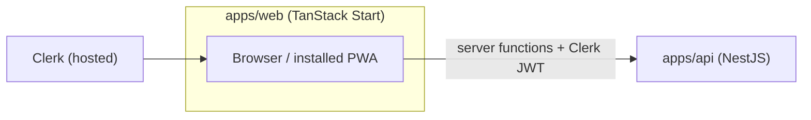
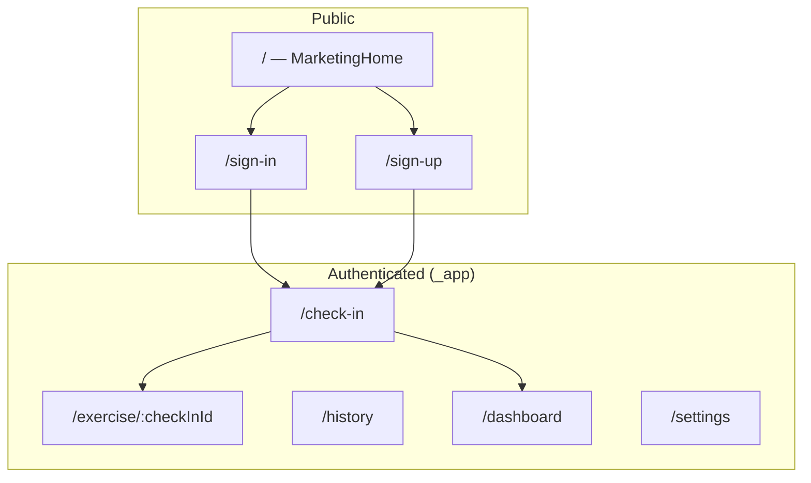

# Aura Web Client — Design & Component Reference

> **Status: Active (MVP)** — TanStack Start delivers the full MVP as a **desktop-first dashboard** plus an installable **PWA** for on-the-go check-ins and exercise completion. Native mobile is in the backlog; see [MOBILE.md](../../../docs/MOBILE.md).

Product scope: [PRD.md](../../../docs/PRD.md). Visual language: [DESIGN.md](../../../docs/DESIGN.md). API contracts: [API.md](../../api/docs/API.md).

---

## Role in the monorepo

| Concern | Location |
|---------|----------|
| Web app | `apps/web/` |
| API | `apps/api/` |
| Shared types / validators | `packages/types`, `packages/validators` (when present) |
| Native mobile (backlog) | `apps/mobile/` (placeholder) |



---

## Platform & stack

| Layer | Choice | Notes |
|-------|--------|-------|
| Framework | **TanStack Start** + **TanStack Router** | File-based routes under `src/routes/` |
| Build | **Vite 8** | `@tanstack/react-start/plugin/vite` |
| UI | **React 19** | React Compiler via `@rolldown/plugin-babel` |
| Styling | **Tailwind CSS v4** | `@tailwindcss/vite`; tokens from [DESIGN.md](../../../docs/DESIGN.md) |
| Data | **TanStack Query** | SSR integration via `@tanstack/react-router-ssr-query` |
| Forms | **TanStack Form** + **Zod** | Shared schemas from `@aura/validators` when wired |
| Auth | **Clerk** (planned) | Session JWT forwarded to API from server functions |
| Icons | **lucide-react** | Leaf logo, nav, chart affordances |
| PWA | **`public/manifest.json`** | Installable shell; Aura branding TBD |

---

## Current implementation

The app is a TanStack Start scaffold. Implemented today:

| Area | Path | Purpose |
|------|------|---------|
| Root shell | `src/routes/__root.tsx` | HTML document, global CSS, devtools |
| Home route | `src/routes/index.tsx` | Starter placeholder page |
| Router | `src/router.tsx` | Router factory + Query SSR wiring |
| Query integration | `src/integrations/tanstack-query/` | `QueryClient` context, devtools plugin |
| Global styles | `src/styles.css` | Tailwind import + base reset |
| Static assets | `public/assets/aura-hero-bg.png` | Hero imagery for marketing home |
| PWA manifest | `public/manifest.json` | Generic starter manifest (rename/retheme for Aura) |

Planned routes and components below are **not yet built**; they define the target MVP structure.

---

## Target directory layout

```
apps/web/
├── docs/
│   └── WEB.md                    ← this file
├── public/
│   ├── manifest.json             ← PWA manifest (Aura name, theme colors)
│   ├── assets/                   ← hero, icons
│   └── ...
└── src/
    ├── routes/                   ← file-based routes (pages)
    ├── components/               ← reusable UI (planned)
    ├── features/                 ← feature modules: check-in, exercise, analytics (planned)
    ├── lib/                      ← api client, auth helpers, tokens (planned)
    ├── integrations/             ← TanStack Query, Clerk providers
    ├── styles.css
    └── router.tsx
```

Import alias: `#/*` → `./src/*` (see `package.json` `imports`).

---

## Route map (planned)

| Route | File (planned) | Auth | Surface |
|-------|----------------|------|---------|
| `/` | `routes/index.tsx` | No | Marketing home (“Find Your Center”) |
| `/sign-in` | `routes/sign-in.tsx` | No | Clerk `<SignIn />` |
| `/sign-up` | `routes/sign-up.tsx` | No | Clerk `<SignUp />` |
| `/check-in` | `routes/_app/check-in.tsx` | Yes | PWA touchpoint — stress slider + register |
| `/exercise/$checkInId` | `routes/_app/exercise.$checkInId.tsx` | Yes | Exercise card + complete CTA |
| `/history` | `routes/_app/history.tsx` | Yes | Recent check-ins (P1) |
| `/dashboard` | `routes/_app/dashboard/index.tsx` | Yes | Analytics home (desktop-first) |
| `/dashboard/check-ins` | `routes/_app/dashboard/check-ins.tsx` | Yes | Tabular export / drill-down (P1) |
| `/settings` | `routes/_app/settings.tsx` | Yes | Exercise recommendations toggle |

**Layout groups**

- `routes/__root.tsx` — document shell, fonts, Clerk provider, global nav on dashboard routes.
- `routes/_app.tsx` — authenticated layout: redirect to `/` if unsigned; bottom nav on narrow viewports (optional PWA nav).



---

## Component breakdown

Components are grouped by **surface** (who sees them) and **layer** (layout vs feature vs primitive). Paths are targets under `src/components/` unless noted.

### Layout & shell

| Component | Path | Responsibility |
|-----------|------|----------------|
| `RootDocument` | `routes/__root.tsx` (existing) | `<html>`, `<HeadContent>`, `<Scripts>`, devtools in dev |
| `AppShell` | `components/layout/AppShell.tsx` | Max-width container, responsive padding (`container-margin-*` from DESIGN) |
| `AppHeader` | `components/layout/AppHeader.tsx` | Logo + wordmark, optional `Help`, profile menu → sign-out |
| `DashboardLayout` | `components/layout/DashboardLayout.tsx` | Sidebar (desktop) / top bar; wraps analytics pages |
| `PwaNav` | `components/layout/PwaNav.tsx` | Optional bottom bar on small screens: Check-in, History, Dashboard |

### Marketing & auth (public)

| Component | Path | Responsibility |
|-----------|------|----------------|
| `MarketingHome` | `features/marketing/MarketingHome.tsx` | Full-page hero; no API calls; CTAs → Clerk |
| `HeroSection` | `components/marketing/HeroSection.tsx` | `aura-hero-bg.png`, headline *“Find Your Center.”*, supporting copy |
| `AuthCard` | `components/marketing/AuthCard.tsx` | Social + email entry; links to sign-in/up |
| `TrustBadges` | `components/marketing/TrustBadges.tsx` | Private & Secure, Clinically Guided, Science-Backed |
| `LegalFooter` | `components/marketing/LegalFooter.tsx` | Copyright, privacy, terms links |
| `ClerkSignIn` | `routes/sign-in.tsx` | Thin wrapper around Clerk `<SignIn appearance={...} />` |
| `ClerkSignUp` | `routes/sign-up.tsx` | Thin wrapper around Clerk `<SignUp appearance={...} />` |

Marketing copy and layout mirror the anonymous home spec in [MOBILE.md](../../../docs/MOBILE.md) (adapted for responsive web).

### PWA touchpoint — check-in & exercise

| Component | Path | Responsibility |
|-----------|------|----------------|
| `CheckInPage` | `features/check-in/CheckInPage.tsx` | Composes header + card; owns submit mutation |
| `CheckInCard` | `components/check-in/CheckInCard.tsx` | White card: badge, question, helper text, slider, CTA |
| `StressSlider` | `components/check-in/StressSlider.tsx` | Discrete 1–10 range; live level display; band helper text |
| `LevelDisplay` | `components/check-in/LevelDisplay.tsx` | Large numeric score + optional leaf icon |
| `RegisterButton` | `components/ui/PrimaryButton.tsx` | Primary CTA with loading / disabled states |
| `CheckInSuccess` | `components/check-in/CheckInSuccess.tsx` | Post-submit confirmation; optional link to exercise |
| `CheckInError` | `components/check-in/CheckInError.tsx` | Maps API `401` / `429` / network to copy + retry |

**Check-in behavior (MVP)**

- Default slider value: **5**.
- Submit: `POST /api/v1/check-ins` with `{ stressScore, startAssignment }`.
- Phase 1: `startAssignment: false` (log only). Phase 2: `true` + assignment flow.
- Score band helpers (caption): 1–3 calm, 4–6 moderate, 7–8 elevated, 9–10 peak.

| Component | Path | Responsibility |
|-----------|------|----------------|
| `ExercisePage` | `features/exercise/ExercisePage.tsx` | Loads assignment for `checkInId`; SSE or poll fallback |
| `ExerciseCard` | `components/exercise/ExerciseCard.tsx` | Title, description, duration from assignment snapshot |
| `AssignmentPending` | `components/exercise/AssignmentPending.tsx` | “Preparing your exercise…” while `pending` |
| `CompleteExerciseButton` | `components/exercise/CompleteExerciseButton.tsx` | `POST .../complete`; locks compliance |
| `useAssignmentStream` | `features/exercise/useAssignmentStream.ts` | Hook: `EventSource` on `/assignment/stream` |

### Dashboard — analytics (desktop-first)

| Component | Path | Responsibility |
|-----------|------|----------------|
| `DashboardPage` | `features/analytics/DashboardPage.tsx` | Grid of widgets; date range state |
| `DateRangePicker` | `components/analytics/DateRangePicker.tsx` | `from` / `to` for summary + series queries |
| `SummaryMetrics` | `components/analytics/SummaryMetrics.tsx` | Avg stress, check-in count, compliance ratio |
| `MetricCard` | `components/analytics/MetricCard.tsx` | Single KPI with label + trend hint |
| `StressLineChart` | `components/analytics/StressLineChart.tsx` | `GET /analytics/stress-series` (`bucket`: day/week/month) |
| `ComplianceChart` | `components/analytics/ComplianceChart.tsx` | `GET /analytics/compliance-series` |
| `CheckInsTable` | `components/analytics/CheckInsTable.tsx` | `GET /analytics/check-ins` with keyset cursor |
| `EmptyAnalytics` | `components/analytics/EmptyAnalytics.tsx` | Zero-state when no data in range |

Server functions (planned under `src/features/analytics/server/`) fetch analytics with the user’s Clerk JWT — see [API.md](../../api/docs/API.md#web-dashboard--analytics).

### Settings

| Component | Path | Responsibility |
|-----------|------|----------------|
| `SettingsPage` | `features/settings/SettingsPage.tsx` | User preferences |
| `ExerciseRecommendationsToggle` | `components/settings/ExerciseRecommendationsToggle.tsx` | `PATCH /users/me/settings` |

### Shared UI primitives

| Component | Path | Responsibility |
|-----------|------|----------------|
| `Button` | `components/ui/Button.tsx` | Primary / secondary / ghost variants; 48–56px height |
| `Card` | `components/ui/Card.tsx` | 16px radius, ambient shadow per DESIGN |
| `Chip` | `components/ui/Chip.tsx` | e.g. “Current Check-in” badge |
| `Spinner` | `components/ui/Spinner.tsx` | Inline loading |
| `Toast` | `components/ui/Toast.tsx` | Ephemeral success / error (optional) |
| `ErrorBanner` | `components/ui/ErrorBanner.tsx` | Persistent inline errors |

### Integrations & data layer (non-visual)

| Module | Path | Responsibility |
|--------|------|----------------|
| `TanstackQueryProvider` | `integrations/tanstack-query/root-provider.tsx` | `QueryClient` in router context (extend with default options) |
| `apiClient` | `lib/api.ts` | Base URL, `Authorization` from Clerk `getToken()` |
| `serverFns` | `features/*/server/*.ts` | `createServerFn` wrappers that call Nest with forwarded JWT |
| `tokens` | `lib/tokens.css` or `theme.ts` | CSS variables from DESIGN.md YAML |
| `validators` | imports from `@aura/validators` | `CreateCheckInSchema`, etc. |

---

## Responsive behavior

| Viewport | Primary experience |
|----------|-------------------|
| **Mobile / narrow** | PWA: marketing → check-in → exercise; minimal chrome; install prompt |
| **Tablet** | Hybrid: check-in usable; dashboard readable with 8-column grid |
| **Desktop (≥1200px)** | Dashboard as home after sign-in; sidebar nav; 12-column grid, 40px margins |

Check-in UI should remain usable at 320px width (same touch targets as native spec: 48px min, primary button 56px).

---

## PWA

| File | Purpose |
|------|---------|
| `public/manifest.json` | `name`, `short_name`, icons, `theme_color`, `background_color`, `display: standalone` |
| `public/logo192.png`, `logo512.png` | Install icons (replace with Aura assets) |
| Service worker | Add when offline shell or precache is required (post-MVP optional) |

**MVP goals:** installable from browser; `start_url` → `/` or `/check-in` for signed-in users; theme colors aligned with `primary` / `background` from DESIGN (`#47614a`, `#f5fafa`).

---

## API usage by feature

| Feature | Endpoints | Caller |
|---------|-----------|--------|
| Check-in | `POST /check-ins` | Client mutation or server fn |
| History | `GET /check-ins?limit=20` | TanStack Query |
| Assignment | `POST/GET /check-ins/:id/assignment`, SSE stream | Exercise feature |
| Complete | `POST /check-ins/:id/complete` | Exercise feature |
| Profile / settings | `GET /users/me`, `PATCH /users/me/settings` | Settings, bootstrap |
| Dashboard | `GET /analytics/summary`, `stress-series`, `compliance-series`, `check-ins` | Server functions → Query |

Full request/response shapes: [API.md](../../api/docs/API.md).

---

## Design tokens (web)

Map [DESIGN.md](../../../docs/DESIGN.md) to Tailwind `@theme` or CSS variables in `src/styles.css`:

| Token | Value | Usage |
|-------|-------|-------|
| `background` | `#f5fafa` | Page background |
| `primary` | `#47614a` | Buttons, slider fill, chart accent |
| `on-primary` | `#ffffff` | Button labels |
| `on-surface` | `#171d1d` | Headlines |
| `on-surface-variant` | `#434842` | Body, axis labels |
| `surface-container-lowest` | `#ffffff` | Cards |
| `outline-variant` | `#c3c8bf` | Slider track, dividers |

**Typography:** Plus Jakarta Sans (headings), Inter (body) — load via font CDN or `@fontsource` packages.

**Spacing:** 8px grid; mobile horizontal padding 20px, desktop 40px; section gap 48px.

---

## MVP delivery phases

| Phase | Scope | Components / routes |
|-------|--------|---------------------|
| **P0** | Clerk auth + protected app shell | `MarketingHome`, `ClerkSignIn/Up`, `_app` layout |
| **P0** | Stress check-in | `/check-in`, `CheckInCard`, `StressSlider`, `POST /check-ins` |
| **P1** | Recent history | `/history`, `GET /check-ins` |
| **P1** | Dashboard summary | `/dashboard`, `SummaryMetrics`, `DateRangePicker` |
| **P2** | Exercise assignment + complete | `/exercise/$checkInId`, SSE, `ExerciseCard` |
| **P2** | Charts + export table | `StressLineChart`, `ComplianceChart`, `CheckInsTable` |
| **P2** | PWA polish | Aura manifest, icons, theme colors |

Until native mobile ships, everything in [MOBILE.md](../../../docs/MOBILE.md) P0–P2 maps to this web/PWA surface.

---

## Local development

### Prerequisites

- Node 20+
- API running (`apps/api`)
- Clerk application (web redirect URLs configured)

### Commands

```bash
# from monorepo root
npm install
npm run dev -w web    # http://localhost:3000
```

### Environment (planned)

| Variable | Example | Purpose |
|----------|---------|---------|
| `VITE_CLERK_PUBLISHABLE_KEY` | `pk_test_...` | Clerk in browser |
| `CLERK_SECRET_KEY` | `sk_test_...` | Server-only (Start server fns) |
| `API_URL` | `http://localhost:3001` | Nest origin for server functions |

Use the same Clerk instance as any future native app. CORS on the API must allow the web origin in dev.

---

## Related docs

- [PRD.md](../../../docs/PRD.md) — product scope (PWA + dashboard MVP)
- [DESIGN.md](../../../docs/DESIGN.md) — color, type, elevation
- [API.md](../../api/docs/API.md) — REST + analytics contracts
- [MOBILE.md](../../../docs/MOBILE.md) — native backlog; screen specs reused on web
