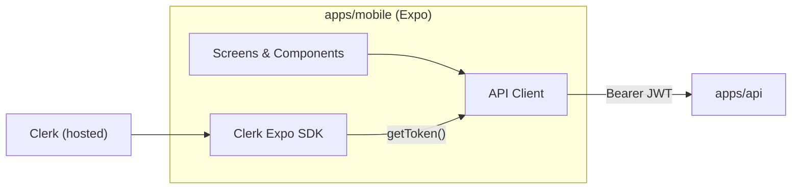
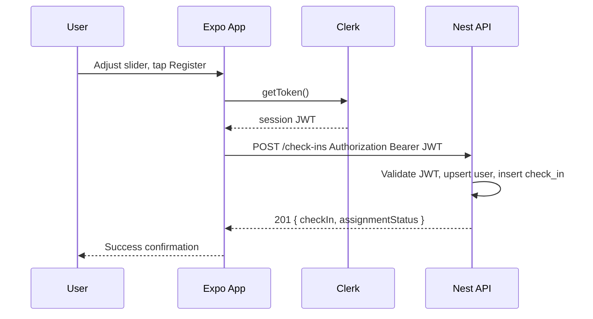

# Aura Native Mobile — Backlog Design Reference

> **Status: Backlog** — A React Native / Expo client is **not** in active development. Due to the overhead of maintaining a native mobile stack alongside the API and web client, MVP delivery uses **TanStack Start** as a **desktop + PWA** web app instead.
>
> **Active client:** [WEB.md](./WEB.md) — check-in, auth, analytics, and installable PWA behavior are specified and built there.
>
> Keep this document as a **future reference** for when a native app is revisited. Screen layouts, flows, and API contracts below remain valid design input; implementation targets `apps/mobile` only if/when native work resumes.

Design reference for a planned Expo (React Native) client. Product scope comes from [PRD.md](./PRD.md). Visual language follows [DESIGN.md](./DESIGN.md). API contracts are defined in [apps/api/docs/API.md](../apps/api/docs/API.md).

The attached UI mockups (check-in slider screen, relief dashboard, anonymous home) are **inspiration only**. When native mobile ships, the intended first slice is: **Clerk auth**, then **stress check-in submission to the API** for the signed-in user.

---

## Planned scope (when native ships)

| Priority | Goal |
|----------|------|
| **P0** | User can sign up / sign in with Clerk. Unauthenticated users never reach app content. |
| **P0** | Authenticated user submits a stress score (1–10) via `POST /api/v1/check-ins`. |
| **P1** | Show confirmation and recent check-in history from `GET /api/v1/check-ins`. |
| **P2** | Exercise assignment flow (SSE + card + complete). |

Until native work starts, these goals are met by the **web/PWA client** ([WEB.md](./WEB.md)).

---

## Platform & Stack (planned)

| Layer | Choice | Notes |
|-------|--------|-------|
| Runtime | **Expo SDK 52+** | Managed workflow; EAS Build for store releases later. |
| Framework | **React Native** + **Expo Router** | File-based routing; `(auth)` and `(app)` route groups. |
| Language | **TypeScript** | Strict mode; shared types from `@aura/types` / `@aura/validators`. |
| Auth | **Clerk** (`@clerk/clerk-expo`) | OAuth + email; session JWT forwarded to API. |
| HTTP | **fetch** or **ky** | Thin wrapper adds `Authorization: Bearer <token>`. |
| Styling | **NativeWind v4** or **StyleSheet + design tokens** | Tokens imported from a local `theme.ts` mirroring [DESIGN.md](./DESIGN.md). |
| Fonts | **Plus Jakarta Sans** (headings), **Inter** (body) | `@expo-google-fonts/*` |



---

## Monorepo placement

```
apps/web/             ← Active client (TanStack Start, desktop + PWA) — see WEB.md
apps/mobile/          ← Backlog placeholder; Expo app if native resumes
packages/types/       ← Shared TypeScript types
packages/validators/  ← Zod schemas (CreateCheckInSchema, etc.)
apps/api/             ← NestJS backend
docs/WEB.md           ← Active client design
docs/MOBILE.md        ← This file (backlog)
```

Workspace dependency (when validators package exists):

```json
"@aura/validators": "workspace:*"
```

---

## Authentication (planned — Step 1 when native resumes)

Identity is fully owned by **Clerk**. The mobile app does not implement custom login/register endpoints against the Aura API.

### User journeys

1. **Cold start, no session** → Anonymous marketing home → auth stack (sign-in / sign-up).
2. **Cold start, valid session** → App stack (check-in home), skipping anonymous home.
3. **Session expired mid-use** → Redirect to sign-in; preserve no sensitive local state.

### Route structure (Expo Router)

```
app/
├── _layout.tsx                 # Root: ClerkProvider, fonts, theme
├── index.tsx                   # Redirect: signed-in → /(app), else → /(auth)/welcome
├── (auth)/
│   ├── _layout.tsx             # Stack, no header
│   ├── welcome.tsx             # Brand + "Get started" / "Sign in"
│   ├── sign-in.tsx             # Clerk SignIn
│   └── sign-up.tsx             # Clerk SignUp
└── (app)/
    ├── _layout.tsx             # Protected layout; redirect if !isSignedIn
    ├── index.tsx               # Check-in screen (primary MVP screen)
    └── history.tsx             # Optional P1: recent check-ins list
```

### Clerk integration

| Concern | Implementation |
|---------|----------------|
| Provider | Wrap root in `<ClerkProvider publishableKey={...} tokenCache={tokenCache}>`. Use `expo-secure-store` token cache on device. |
| Protected routes | In `(app)/_layout.tsx`, use `useAuth()` — if `!isSignedIn`, `<Redirect href="/(auth)/welcome" />`. |
| Sign-out | Profile menu action → `signOut()` → redirect to welcome. |
| API token | Before each request: `const token = await getToken();` → `Authorization: Bearer ${token}`. |

### Anonymous marketing home (unauthenticated)

This screen is inspired by the **\"Find Your Center\"** mockup you provided. It is purely a **marketing/education** surface; it does **not** call Aura APIs or read/write user data. All CTAs funnel into Clerk.

**Layout**

- **Hero section**
  - Background: `background` (`#f5fafa`).
  - Top app bar: left-aligned leaf logo + wordmark **Aura**; right-aligned `Help` text button.
  - Center hero image: rounded-rectangle phone mock or illustration, 24px radius, subtle shadow, bleeding into a soft gradient.
  - Overlaid heading (Plus Jakarta Sans, headline-lg-mobile): *\"Find Your Center.\"*
  - Supporting copy (Inter, body-md): *\"Join Aura to track stress, build resilience, and discover daily moments of relief.\"*

- **Auth card**
  - Surface: `surface-container-lowest` (`#ffffff`) card with 16px radius and ambient shadow (see [Design tokens](#design-tokens-mobile)).
  - Title (headline-md): *\"Start your journey\"*.
  - Subtitle (body-md, on-surface-variant): *\"Create your account to begin.\"*
  - **Primary actions:**
    - `Continue with Google` (filled button, white background, subtle border, Google logo on the left).
    - `Continue with Apple` (same pattern, Apple logo). Exact social providers depend on Clerk configuration.
  - **Email path:**
    - Divider row: centered `OR` label between thin `outline-variant` lines.
    - Email text field (rounded 8px, neutral border; on focus → `primary` border + soft glow).
    - Primary CTA button: full-width, 56px tall, `primary` background (`#47614a`), label *\"Continue with Email\"* in `on-primary`.
  - Footer line (caption): *\"Already have an account? Log in\"* with `Log in` as a tappable link to the sign-in flow.

- **Trust badges**
  - Row of three compact items at bottom: icon + caption using the mockup labels: *\"Private & Secure\"*, *\"Clinically Guided\"*, *\"Science-Backed\"*.
  - Typography: caption size, low-contrast (`on-surface-variant`).

- **Legal footer**
  - Small caption with *\"© 2024 Aura Wellbeing\"* and links to *\"Privacy Policy\"* and *\"Terms of Service\"*.

**Behavior**

- Scrollable layout on small devices; content centered on taller screens.
- All primary CTAs route into the corresponding **Clerk** auth screen:
  - Social buttons → Clerk social sign-in/up.
  - Email flow → prefill email field on Clerk sign-up/sign-in where possible.
- From this screen, the user cannot access check-ins or data; it is safe to show even if the API is offline.

### Auth screens (visual spec)

**Welcome / auth shell** — The anonymous marketing home effectively replaces the earlier plain welcome. It still uses the **Aura** wordmark, `background` color, and the same general typography tokens.

**Sign-in / Sign-up** — Embed Clerk prebuilt components (`<SignIn />`, `<SignUp />`) with `appearance` overrides:

- Primary color → `#47614a`
- Border radius → `12px` (cards), `8px` (inputs)
- Font family → Inter

No API calls on auth screens except Clerk's own services.

### Environment variables

| Variable | Example | Purpose |
|----------|---------|---------|
| `EXPO_PUBLIC_CLERK_PUBLISHABLE_KEY` | `pk_test_...` | Clerk client |
| `EXPO env` | `development` | Feature flags / logging |

Use `.env` + `app.config.ts` to inject public vars. Never ship secret keys in the mobile bundle.

---

## Check-in flow (planned — Step 2 when native resumes)

After auth, the default screen is **Current Check-in**: a low-friction stress logger inspired by the mockup (slider, level number, Register CTA).

### Screen anatomy

```
┌─────────────────────────────────────┐
│  [≡]           Aura            [◎]  │  ← AppHeader (menu placeholder, profile)
├─────────────────────────────────────┤
│  ┌ Current Check-in ─┐              │  ← Chip / badge (caption, outline-variant)
│                                     │
│  How are you feeling                │  ← headline-lg-mobile
│  right now?                         │
│                                     │
│  Take a moment to breathe and       │  ← body-md, on-surface-variant
│  observe your current stress levels.│
│                                     │
│  ┌─────────────────────────────┐   │
│  │  LEVEL          [leaf icon] │   │  ← CheckInCard (surface-container-lowest)
│  │    7                        │   │     Large numeric stress score
│  │  ────●──────────────────    │   │     Slider 1–10
│  │  Calm              Peak     │   │
│  │  ┌─────────────────────┐    │   │
│  │  │     Register        │    │   │     Primary button
│  │  └─────────────────────┘    │   │
│  └─────────────────────────────┘   │
└─────────────────────────────────────┘
```

### Interaction

| Element | Behavior |
|---------|----------|
| Slider | Discrete steps 1–10; haptic light impact on value change (`expo-haptics`). |
| Level display | Updates live with slider; minimum 1, maximum 10. |
| Register | Validates signed-in state → POST check-in → loading → success or error. |
| Default value | Start at **5** (neutral) on first open; optional: remember last submitted score locally. |

### Labels by score band (optional helper text under slider)

| Score | Helper (caption) |
|-------|------------------|
| 1–3 | "Feeling calm" |
| 4–6 | "Moderate tension" |
| 7–8 | "Elevated stress" |
| 9–10 | "Peak stress" |

### Post-submit states

1. **Loading** — Disable slider and button; show spinner on button label "Registering…".
2. **Success** — Toast or inline banner: *"Check-in saved."* Show `createdAt` in local time. Reset slider to 5 or keep value (product choice: reset encourages new reading).
3. **Error** — Inline error card with retry. Map API errors: `401` → force re-auth; `429` → "Too many check-ins, try again shortly"; network → offline message.

For an initial native slice, use **`startAssignment: false`** so the client only logs stress until assignment endpoints are live (same as web MVP):

```json
{ "stressScore": 7, "startAssignment": false }
```

When exercise flow is enabled, flip to `startAssignment: true` (or omit; API default when recommendations enabled).

---

## API integration

Base URL: `{API_ORIGIN}/api/v1` (e.g. `http://localhost:3000/api/v1` in dev).

### Client module (`src/lib/api.ts`)

Responsibilities:

- Resolve base URL from `EXPO_PUBLIC_API_URL`
- Attach Clerk JWT on every protected call
- Parse JSON; throw typed `ApiError` with `statusCode` and `message`
- Validate responses with Zod where schemas exist

### MVP endpoints used

#### `POST /check-ins`

**Request**

```typescript
import { CreateCheckInSchema } from '@aura/validators';

const body = CreateCheckInSchema.parse({
  stressScore: selectedScore,
  startAssignment: false, // MVP: log only
});
```

**Response `201`**

```typescript
{
  checkIn: {
    id: string;           // UUID v7
    stressScore: number;  // 1–10
    createdAt: string;    // ISO 8601 UTC
  },
  assignmentStatus: 'skipped' | 'pending' | 'ready';
}
```

**Native client handling (planned)**

- Persist `checkIn.id` in local success state / history cache
- Ignore `assignmentStatus` for UI until exercise screens exist

#### `GET /check-ins?limit=20` (P1)

Populate history screen or a "Recent" section on home.

```typescript
{
  items: Array<{
    id: string;
    stressScore: number;
    createdAt: string;
    assignment?: {
      status: string;
      exerciseTitle?: string;
      completedAt?: string | null;
    };
  }>;
  nextCursor: string | null;
}
```

#### `GET /users/me` (optional bootstrap)

Call once after sign-in to ensure API user row exists and read settings. Not blocking for first check-in if API upserts on first authenticated request.

### Sequence (MVP check-in only)



### Error contract

API errors: `{ statusCode, message, error? }`. Display `message` when string; join when array.

| Status | Mobile action |
|--------|---------------|
| `400` | Show validation message (should not happen if client validates with Zod) |
| `401` | Sign out or refresh token; redirect to auth |
| `429` | Rate-limit copy + disable Register temporarily |
| Network | Offline banner; queue retry optional (out of MVP scope) |

---

## Design tokens (mobile)

Map [DESIGN.md](./DESIGN.md) YAML to `src/theme/tokens.ts`:

| Token | Value | Mobile usage |
|-------|-------|--------------|
| `background` | `#f5fafa` | Screen background |
| `primary` | `#47614a` | Buttons, active accents, slider fill |
| `on-primary` | `#ffffff` | Button label |
| `on-surface` | `#171d1d` | Headlines |
| `on-surface-variant` | `#434842` | Body, slider labels |
| `surface-container-lowest` | `#ffffff` | Check-in card |
| `outline-variant` | `#c3c8bf` | Slider track inactive |
| `error` | `#ba1a1a` | Error text |

**Spacing:** 8px grid; screen horizontal padding `20px` (`container-margin-mobile`).

**Radius:** Card `16px` (`lg`), button `8px` (`DEFAULT`), chip `full`.

**Shadow (card):** iOS `shadowOpacity: 0.05`, `shadowRadius: 10`, `shadowOffset: { width: 0, height: 4 }`; Android `elevation: 2`.

**Touch targets:** Minimum 48×48pt for header icons and primary button height 56px.

### Typography mapping

| Role | Style | RN |
|------|-------|-----|
| Screen title | headline-lg-mobile | 28 / 600 / Plus Jakarta Sans |
| Card question | headline-md | 24 / 600 |
| Body | body-md | 16 / 400 / Inter |
| Badge | caption + label weight | 12 / 600 |
| Level number | display scaled | 48 / 700 / Plus Jakarta Sans |

---

## Component inventory (MVP)

| Component | Path | Notes |
|-----------|------|-------|
| `AppHeader` | `src/components/AppHeader.tsx` | Title, optional menu stub, profile → sign-out |
| `CheckInCard` | `src/components/CheckInCard.tsx` | Slider + level + CTA |
| `StressSlider` | `src/components/StressSlider.tsx` | `@react-native-community/slider` or custom PanResponder |
| `PrimaryButton` | `src/components/PrimaryButton.tsx` | Loading state |
| `Screen` | `src/components/Screen.tsx` | SafeArea + background + padding |

Defer bottom tab bar (`Relief`, `Explore`, `Journal`, `Insights` from mockups) until exercise and analytics screens exist. Native MVP would use a **single-stack** `(app)` with check-in as `index`.

---

## Navigation roadmap (post-MVP)

Inspired by mockup bottom navigation — not in v1.0 build:

| Tab | Future purpose |
|-----|----------------|
| **Relief** | Home: contextual exercise recommendations after check-in |
| **Explore** | Browse exercise catalog |
| **Journal** | Qualitative notes + mood tags (v2 Mood Cloud) |
| **Insights** | Lightweight mobile stats; full analytics on {web dashboard} |

When added, use Expo Router `(app)/(tabs)/_layout.tsx` with a custom tab bar matching mockup: pill-shaped active indicator on `primary` background.

---

## Exercise flow (P2 — backlog, after check-in slice)

Documented for continuity with [API.md](../apps/api/docs/API.md). Implement after check-in-only MVP is stable.

1. `POST /check-ins` with `startAssignment: true`
2. If `assignmentStatus === 'pending'`, open SSE `GET /check-ins/:id/assignment/stream`
3. On `ready`, navigate to **Exercise** screen (mockup: sure you want to start "Box Breathing"?)
4. `POST /check-ins/:id/complete` on user confirmation

Relief dashboard mockup maps to this tab once SSE + assignment UI ship.

---

## Local development (when native work resumes)

> Not applicable while native mobile is on backlog. Use [WEB.md](./WEB.md) for the active client dev setup.

### Prerequisites

- Node 20+
- Expo Go on device/simulator, or iOS Simulator / Android emulator
- Clerk application (Expo redirect URLs configured)
- API running locally (`apps/api`)

### Config

```bash
# apps/mobile/.env
EXPO_PUBLIC_CLERK_PUBLISHABLE_KEY=pk_test_...
EXPO_PUBLIC_API_URL=http://localhost:3000
```

**Physical device:** Replace `localhost` with machine LAN IP for API URL.

### Commands (target)

```bash
npm install          # from monorepo root
npm run start -w mobile   # expo start
```

### Clerk dashboard

- Enable Native applications / Expo
- Add redirect URLs for dev (`exp://...`, custom scheme `aura://`)
- Same Clerk instance as web dashboard when it exists

### API CORS

Nest must allow mobile origins in dev if using web-based testing; native apps often bypass CORS. Ensure JWT `aud` / issuer match API guard config.

---

## Project structure (`apps/mobile`)

```
apps/mobile/
├── app/                        # Expo Router
│   ├── _layout.tsx
│   ├── index.tsx
│   ├── (auth)/
│   └── (app)/
├── src/
│   ├── components/
│   ├── lib/
│   │   ├── api.ts
│   │   └── clerk.ts
│   ├── hooks/
│   │   └── useCheckIn.ts
│   └── theme/
│       └── tokens.ts
├── assets/
│   └── images/
├── app.config.ts
├── package.json
├── tsconfig.json
├── .env.example
└── README.md
```

### `useCheckIn` hook (sketch)

```typescript
export function useCheckIn() {
  const { getToken } = useAuth();
  const [status, setStatus] = useState<'idle' | 'loading' | 'success' | 'error'>('idle');
  const [lastCheckIn, setLastCheckIn] = useState<CheckIn | null>(null);
  const [error, setError] = useState<string | null>(null);

  const submit = async (stressScore: number) => {
    setStatus('loading');
    setError(null);
    try {
      const token = await getToken();
      if (!token) throw new Error('Not authenticated');
      const result = await createCheckIn(token, { stressScore, startAssignment: false });
      setLastCheckIn(result.checkIn);
      setStatus('success');
    } catch (e) {
      setError(e instanceof ApiError ? e.message : 'Something went wrong');
      setStatus('error');
    }
  };

  return { submit, status, lastCheckIn, error };
}
```

---

## Testing strategy

| Layer | Approach |
|-------|----------|
| Validators | Unit test shared Zod schemas in `packages/validators` |
| API client | Mock `fetch`; assert headers include Bearer token |
| Check-in screen | Component test: slider updates level; submit calls hook |
| E2E | Detox or Maestro later; manual QA sufficient for MVP slice |

Manual QA checklist:

- [ ] Sign up new user → lands on check-in
- [ ] Sign-in existing user → check-in
- [ ] Submit score → API receives row (verify via DB or `GET /check-ins`)
- [ ] Sign out → cannot reach check-in without auth
- [ ] Airplane mode → error message, no crash

---

## Security & privacy

- Tokens only in secure storage (Clerk token cache)
- No stress scores in logs/analytics payloads in production
- Health-adjacent data: minimize third-party analytics on MVP screens
- Certificate pinning: out of scope for MVP; revisit for production hardening

---

## Implementation phases (backlog)

These phases apply **only if** native mobile development is restarted. Until then, equivalent work lives under [WEB.md](./WEB.md).

### Phase A — Scaffold & auth

- [ ] `apps/mobile` Expo app in monorepo
- [ ] Clerk provider + `(auth)` routes + protected `(app)` shell
- [ ] Theme tokens + `AppHeader` + anonymous marketing home

### Phase B — Check-in

- [ ] `StressSlider` + `CheckInCard` UI
- [ ] API client + `POST /check-ins` with `startAssignment: false`
- [ ] Success / error states

### Phase C — History

- [ ] `GET /check-ins` list on `history.tsx` or home section

### Phase D — Exercise flow

- [ ] SSE or polling for assignment
- [ ] Exercise detail screen + complete
- [ ] Bottom tabs; Relief as default

---

## Related docs

- [WEB.md](./WEB.md) — **active** TanStack Start client (desktop + PWA)
- [PRD.md](./PRD.md) — product scope
- [DESIGN.md](./DESIGN.md) — visual system
- [apps/api/docs/API.md](../apps/api/docs/API.md) — REST contracts
