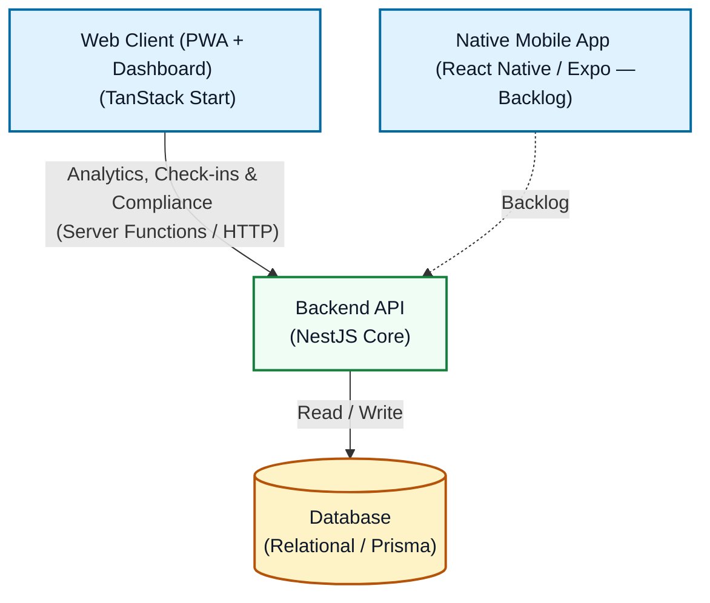

# 🌌 Project PRD: Aura (Mental Health Tracker & Ecosystem)
## Product Overview
Aura is a self-contained, multi-platform mental health ecosystem designed to help users pause, evaluate their immediate mental state, engage in brief therapeutic exercises, and track emotional trends over time.

The core philosophy of Aura is low-friction engagement. For MVP, the web module serves both roles: an installable **PWA** for quick check-ins on the go, and a desktop-first dashboard for long-term analytics. A dedicated **native mobile app** is in the backlog.

## Target Audience & Core Value
**The User**: Individuals seeking a private, streamlined tool to manage daily stress, anxiety, or mental fatigue without heavy, overly complex logging requirements.

**The Value**: Closing the loop between data collection and immediate relief. Aura doesn't just track how stressed a user is; it instantly provides a behavioral exercise to address that state.

## System Architecture (High-Level)
Aura is structured as a TypeScript monorepo to maximize type safety, code sharing, and development velocity. MVP ships **web (PWA + dashboard)** and **API**; a native mobile client remains in the backlog.

   
_Component Breakdown_
**Web Client (MVP)**: Built using TanStack Start. Delivers the full MVP experience as a desktop-first dashboard plus an installable **PWA** for on-the-go check-ins and exercise completion. See [WEB.md](../apps/web/docs/WEB.md).

**Backend API**: Built using NestJS. Serves as the centralized brain handling state storage, user identity, telemetry aggregation, and exercise dispatch logic.

**Native Mobile App (Backlog)**: Planned as React Native (Expo) for fast execution, native notifications, and a responsive single-screen flow. Not in MVP scope; see [MOBILE.md](./MOBILE.md).

## MVP Functional Scope (Version 1.0)
The objective of the MVP is to prove the end-to-end data pipeline across the **web client (PWA + dashboard)** and **backend API** using deterministic, high-performance logic. Mobile check-in and exercise flows ship in the web module as a PWA rather than a separate native app.

### Web Client Features (PWA + Dashboard)

#### PWA / Mobile Touchpoint
**Quick Check-In**: A primary interactive controller allowing the user to select a numerical stress score from 1 to 10.

**Static Exercise Delivery**: Upon submitting a stress score, the app instantly renders a specific therapeutic activity card (title, description, duration) fetched from the backend.

**Completion Logging**: A clear action button confirming the exercise was completed, which locks the event into history.

#### Dashboard (Desktop)
**Authentication & Access**: A protected web space mapped to the corresponding user data profile.

**Trend Visualization**: High-impact metric widgets showing average stress levels, exercise completion compliance ratios, and historical line charts tracking stress deltas over weeks or months.

### Backend API Features
**Ingestion Endpoints**: Secure endpoints to receive stress logs, fetch tailored exercises, and record execution compliance.

**Deterministic Matching Engine**: A static rule matrix that evaluates incoming numerical stress values and immediately maps them to the correct structural category of exercise.

**Data Aggregation**: Aggregates telemetry records partitioned by time chunks to feed the web dashboard efficiently.

## Future Roadmap (Version 2.0+)
**Native Mobile App**: A React Native / Expo client for native notifications, background scheduling, and an optimized single-screen mobile flow. Design reference: [MOBILE.md](./MOBILE.md).

Once the core multi-platform sync engine is stable, Aura will expand to include qualitative telemetry and autonomous contextual logic.

**The Mood Cloud (Qualitative Data)**: Introducing a multi-tag select interface ("Calm", "Focused", "Anxious", "Tired") alongside the numerical slider during mobile check-ins to capture granular emotional context.

**Agentic AI Engine**: Transitioning from the deterministic matching engine to an LLM-powered agent framework within NestJS. The agent will consume the user's explicit score, qualitative tags, and historical exercise compliance to generate fully customized, context-aware exercises on the fly.

**Intelligent Reminders**: Native background notifications driven by scheduling patterns or anomalies in tracking history to nudge users toward proactive exercises.

**Advanced Web Analytics**: Cross-referencing qualitative data strings against quantitative stress scores to surface hidden emotional drivers (e.g., correlations between specific mood tags and stress peaks).

## Non-Functional & Technical Requirements
**Type Safety**: Absolute shared typing across the API payloads, mobile data structures, and web components utilizing a internal workspace package.

**Performance**: Mobile API requests must respond within acceptable network limits to preserve low-friction user psychology.

**Data Privacy**: Strict isolation of health-adjacent user logs at the database level.

**Local Simulation Capacity**: The entire ecosystem must be capable of running smoothly in a local development environment (Docker/Localhost) to ensure rapid developer iteration.